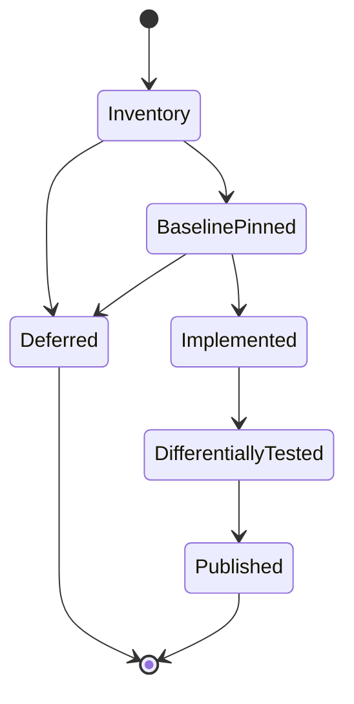
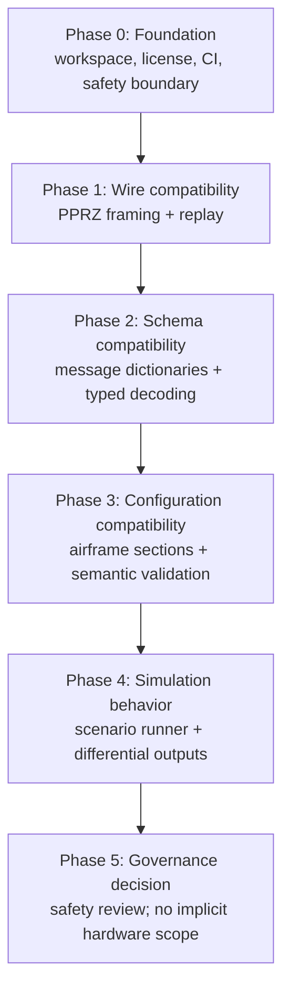

# Migration plan, metrics, and milestones

## Delivery model

Each feature moves through the same evidence gate:

`Published` means the change is formatted, linted, tested, committed, pushed,
and accompanied by its provenance and compatibility statement. It does not
mean flight-ready.

## Metrics

| Metric | Target | Measurement | Gate |
| --- | --- | --- | --- |
| Transport capture acceptance | 100% for a pinned capture | accepted / total valid upstream frames | Required before claiming wire compatibility |
| Typed decode completeness | 100% for a pinned dictionary + capture pair | typed decoded / accepted frames | Required before claiming message compatibility |
| Differential fixture coverage | 100% of supported feature rows | rows with source, fixture, expected result | Required for release scope |
| Regression protection | One test per resolved defect | test inventory review | Required before merge |
| Static quality | Zero formatter and strict-Clippy findings | CI results | Required before merge |
| Unsupported-scope clarity | 100% of inventory rows carry a state | progress report review | Required before release |
| Hardware surface | Zero in foundation releases | dependency/API review | Mandatory safety gate |

Code-line coverage may be collected later, but it is not a compatibility metric
by itself. Differential behavior, corpus coverage, and provenance are the
primary evidence.

## Phases and milestones

| Phase | Milestone | Exit criteria | Dependencies |
| --- | --- | --- | --- |
| 0 | Foundation | Workspace, GPL attribution, CI, safety scope, documentation | None |
| 1 | Transport/replay | Golden frames, malformed recovery, pinned recording replay | Pinned PPRZ format and recording |
| 2 | Typed telemetry | Pinned dictionary parses; all capture frames decode; field assertions | Matching dictionary/capture pair |
| 3 | Configuration semantics | Sections and defines parse; resolution rules tested against upstream fixtures | Airframe DTD/rules and fixture corpus |
| 4 | Offline simulation | Deterministic scenario inputs and upstream-vs-Rust result comparisons | Stable typed messages and configuration semantics |
| 5 | Scope decision | Independent safety review and explicit authorization for any expanded scope | Completed prior evidence; no automatic progression |

Phases 0–2 are substantially complete only for their documented legacy
baseline. Phase 3 is partially complete; phases 4–5 have not started.

## Verification cadence

1. Add or update the feature inventory and pin upstream evidence.
2. Add a failing golden, corpus, or differential test.
3. Implement the smallest compatible Rust behavior.
4. Run `cargo fmt --check`, strict Clippy, and workspace tests.
5. Record the result in the progress report and commit/push the increment.
