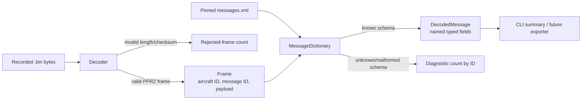
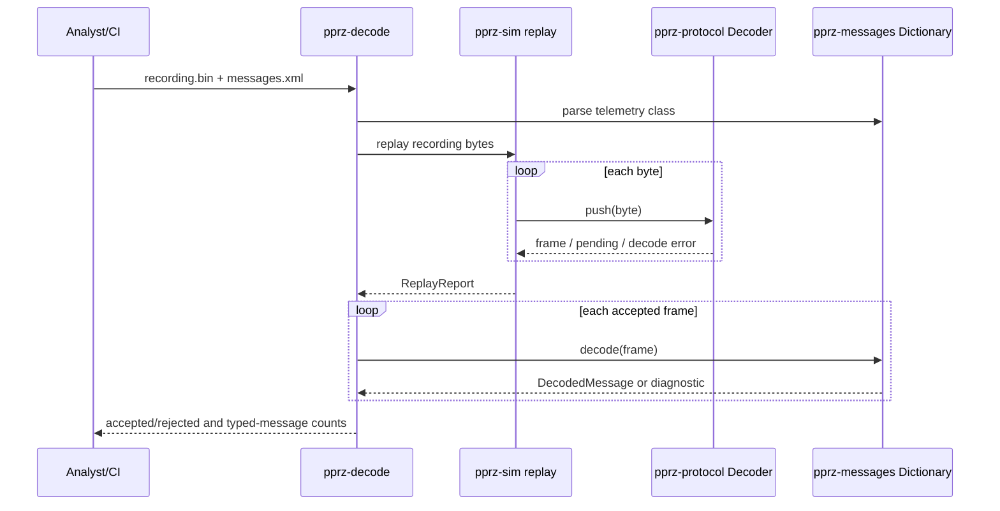

# Migration progress report

Snapshot: 2026-07-18. Status reflects the checked-in Rust workspace, not the
full Paparazzi upstream project.

## Status summary

| Area | Status | Evidence | Dependencies / next step |
| --- | --- | --- | --- |
| Workspace, licensing, CI | Complete | GPL-2.0-only, attribution, GitHub Actions quality gate | Maintain with every change |
| PPRZ v1 encoding/decoding | Complete for pinned format | Golden frames, corrupt recovery, exhaustive legal payload lengths | More captures/version variants |
| Recorded stream replay | Complete for pinned recording | 941 accepted, 0 rejected | Additional recording corpus |
| Legacy XML dictionary parsing | Complete for pinned 2009 dictionary | `class`/`msg_class`, primitive scalars and count-prefixed arrays | Modern schema fixture pairs |
| Legacy typed telemetry decoding | Complete for pinned capture | 941 decoded, 0 unknown, 0 malformed | Per-field differential oracle for future schemas |
| Firmware/target/module/define parsing | Implemented subset | Bebop-style XML tests | Sections and semantic resolution |
| Airframe sections | Pending | No public API or behavior yet | Upstream DTD/rules and fixtures |
| Command laws | Pending | Explicitly excluded from parser semantics | Safety review and a separate scope decision |
| Math primitives | Seed only | One deterministic conversion test | Inventory of required simulation math |
| Scenario simulation | Not started | No dynamics or scenario runner | Completed config semantics and typed telemetry corpus |
| Hardware and flight control | Excluded | No interfaces or dependencies | Explicit future authorization and safety program |

## Offline telemetry data flow

## Pinned compatibility evidence

| Artifact | Upstream source | Result |
| --- | --- | --- |
| PPRZ transport reference | `f43dc86f5130e0deb03d0f0206e72b37ca8a97c5`, `pprz_transport.py` | Frame format and recovery tests |
| Legacy recording | `728c36e2a694eaab9c1335f37e6907f40b8d27db`, `sw/in_progress/log_parser/pprz.bin` | 941/941 frames accepted and typed-decoded |
| Legacy dictionary | Same 2009 commit, `conf/messages.xml` | Matching field layouts and array-count convention |
| Airframe subset | `f43dc86f5130e0deb03d0f0206e72b37ca8a97c5`, Bebop airframe example | Fixture-based structural parsing |

## Decode sequence

## Decision rules

- “Complete” always means complete for the precise pinned baseline named in
  this report.
- “Pending” means no compatibility claim exists yet.
- “Excluded” means implementation is prohibited in the foundation phase.
- A status changes only with automated evidence and an updated provenance row.
