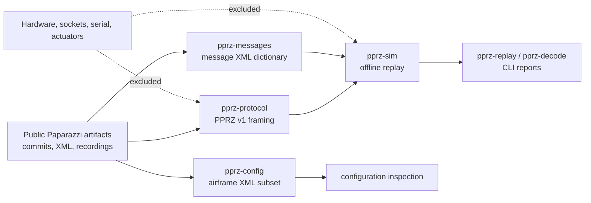
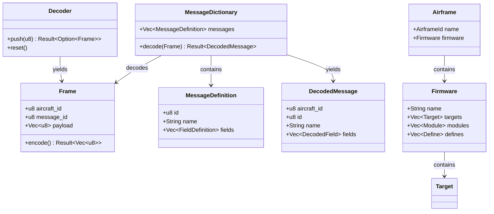

# Project understanding

## Purpose

`paparazzi-rust` is an independent Rust compatibility toolchain for selected,
public Paparazzi UAS artifacts. Its current purpose is to make protocol,
configuration, and recorded-telemetry behavior inspectable and reproducible
offline. It is not a port of the entire Paparazzi flight stack and must not
control an aircraft or hardware.

The project uses a clean-room compatibility approach: pin public upstream
inputs, implement a narrow Rust behavior, and retain automated evidence that
the Rust result matches the pinned source or capture.

## Workspace structure

| Component | Role | Inputs | Outputs | Boundary |
| --- | --- | --- | --- | --- |
| `pprz-protocol` | PPRZ v1 frame encoding and stream decoding | Raw bytes, frames | Frames, decode errors | No sockets, serial, or hardware |
| `pprz-messages` | Message XML dictionary parsing and typed payload decoding | XML dictionary, frames | Definitions, typed values | Offline interpretation only |
| `pprz-config` | Airframe XML parsing | Airframe XML | Airframe/firmware/target declarations | Parse and validate only |
| `pprz-math` | Deterministic math primitives | Numeric values | Numeric values | Pure functions |
| `pprz-sim` | Recorded-stream replay and command-line analysis | Recording bytes, dictionary | Replay report and decode summary | No actuator, network, or serial interfaces |

## Functional requirements

| ID | Requirement | Current boundary |
| --- | --- | --- |
| FR-1 | Encode and decode PPRZ v1 frames, including malformed-stream recovery. | Implemented offline. |
| FR-2 | Replay a finite byte recording deterministically and report accepted/rejected frames. | Implemented offline. |
| FR-3 | Parse named Paparazzi message classes and decode supported primitive payload fields. | Implemented for pinned legacy capture. |
| FR-4 | Parse airframe identity, firmware, targets, modules, and defines. | Implemented subset. |
| FR-5 | Preserve upstream provenance and automated compatibility evidence for every supported behavior. | Required for every milestone. |
| FR-6 | Produce no hardware, actuator, network, or flight-control effects. | Mandatory safety constraint. |

The intentionally deferred requirements are airframe sections, command laws,
modern dictionary variants without a pinned capture, simulator dynamics, and
all onboard-control behavior.

## Architectural diagram

## Core data structures

## Non-functional requirements

- Determinism: the same input must yield the same Rust result.
- Traceability: each supported behavior has a pinned upstream source or
  recording and a comparison rule.
- Safety: no direct device or control interface is added in this phase.
- Maintainability: components are small crates with explicit ownership and
  strict CI checks.
- Honesty of scope: unsupported formats fail or remain documented as deferred;
  they are never represented as migrated.
