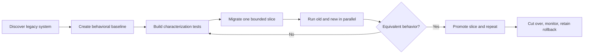

Treat this as a behavioral-preservation program, not a language translation project.

Your real deliverable is:

> “A new implementation that can replace the old one without changing the system’s externally observable behavior, except for explicitly approved improvements.”

That framing solves the central problem: when you don’t understand the original system, the old system itself becomes the oracle.



## 1. Establish a migration contract

Before any code change, define:

- Scope: repositories, branches, services, jobs, scripts, databases, build/deploy pipelines, integrations, and operational runbooks.
- Target: the target language, runtime, supported OS/platforms, dependencies, performance constraints, and security requirements.
- Compatibility policy: what must remain identical; what may intentionally change; what behavior is unknown and must be preserved by default.
- Completion definition: required test coverage, parity thresholds, production soak period, documentation, and rollback plan.

The framework should always maintain a machine-readable `migration-contract.yml`, so the agent has a persistent mandate rather than relying on repeated prompts.

## 2. Create an inventory before translating

The first agent phase should be discovery only. It should produce a living system map:

- Source modules and dependency graph
- Executables, libraries, APIs, CLIs, batch jobs, and scheduled tasks
- Configuration files, environment variables, secrets references, and feature flags
- Databases, schemas, migrations, file formats, queues, and external integrations
- Build, test, packaging, CI/CD, and deployment behavior
- Known and unknown areas, with confidence levels
- Dead code candidates, but never delete them early

A useful output is a traceability matrix:

| Legacy component | Observed responsibilities | Tests / captured behavior | New component | Parity status |
|---|---|---|---|---|
| `legacy/parser.x` | parses input format | 247 fixtures | `parser.ts` | 247/247 passing |

Nothing is “done” unless it maps from legacy component → evidence → replacement → verified status.

## 3. Use the old implementation as the specification

Documentation will be incomplete. Build a characterization harness around the legacy system:

- Capture representative real inputs, after anonymization.
- Generate adversarial and boundary inputs.
- Record outputs, API responses, exit codes, logs where relevant, filesystem changes, database changes, and side effects.
- Run the legacy and new versions against the same input corpus.
- Compare results automatically.

This is differential testing. It is the strongest confidence mechanism when no human fully understands the system.

For nondeterministic behavior, normalize known variable fields such as timestamps, IDs, ordering, random seeds, and paths. Where exact equality is inappropriate, define explicit invariants—for example, “same records, order irrelevant,” or “within 1% numerical tolerance.”

## 4. Migrate vertically, not file-by-file

Avoid a giant “translate all code, then test” effort. It produces a long period with no evidence of success.

Instead, migrate thin, end-to-end slices:

1. Choose a bounded capability.
2. Add characterization tests and fixtures.
3. Implement the replacement.
4. Run differential tests.
5. Ship it behind a flag or in shadow mode.
6. Measure real parity.
7. Mark it complete in the migration ledger.
8. Move to the next slice.

Prioritize by risk and value:

- Critical user flows and data integrity first
- High-change or poorly understood modules early
- Isolated, low-risk modules as early wins
- Dead-code removal last

## 5. Measure confidence with multiple signals

There is no single trustworthy “migration percentage.” Use a scorecard:

| Metric | What it tells you |
|---|---|
| Inventory coverage | How much of the known system has an explicit migration status |
| Behavioral parity rate | Percentage of legacy-vs-new test cases producing equivalent results |
| Critical-path parity | Whether key flows are fully verified; this should be 100% before cutover |
| Interface coverage | APIs, CLI commands, schemas, events, file formats, and integrations tested |
| Code-path coverage | Coverage while running the legacy system’s characterization suite |
| Shadow-mode divergence | Real production discrepancies between old and new |
| Operational parity | Build, deployment, monitoring, backup, restore, and rollback readiness |
| Unknown-risk count | Unmapped dependencies, unexplained behavior, missing test cases |
| Defect escape rate | Migration defects found after a slice is declared complete |

A sensible completion gate is not “100% rewritten.” It is closer to:

- 100% of critical interfaces mapped and tested
- 100% critical-path parity
- ≥99.9% parity on representative corpus, with every exception reviewed
- Zero unexplained production shadow divergences for an agreed soak period
- Validated rollback and data-recovery drills
- All remaining gaps explicitly accepted by an accountable human

## 6. Build an autonomous migration controller

You do not want an agent that waits for “what next?” You want a controller that continuously chooses the next safe action from persistent project state.

Its loop should be:

```text
Read migration contract and current ledger
→ inspect evidence and failures
→ identify the highest-priority unverified slice
→ plan the smallest safe next action
→ implement or investigate
→ run required validation
→ record evidence, risks, and status
→ update dashboard
→ repeat
```

The agent should be permitted to autonomously:

- Read code, documentation, issues, CI, and test results
- Create inventories and test fixtures
- Implement isolated migration slices
- Run tests, static analysis, benchmarks, and local environments
- Update the migration ledger, changelog, risk register, and dashboard
- Open draft pull requests with evidence

Require approval for:

- Production deployment or data migration
- Deleting legacy code or infrastructure
- Changing public APIs, schemas, security boundaries, or compatibility guarantees
- Spending beyond a defined budget
- Marking an ambiguity as an intentional behavior change

That balance is important. “Figure it out” works for investigation and execution; irreversible product decisions need explicit governance.

## 7. Make project state self-updating

Keep these files in the repository so humans and agents share one source of truth:

```text
/migration
  contract.yml          # scope, compatibility and completion rules
  inventory.yml         # discovered components and dependencies
  ledger.yml            # per-component migration status and evidence
  risks.yml             # unknowns, owners, mitigation and severity
  decisions.md          # approved behavior changes / architecture decisions
  dashboard.md          # generated progress summary
/tests
  characterization/     # legacy behavior fixtures
  differential/         # old-vs-new comparison tests
```

Every meaningful agent action should update the ledger with:

- What changed
- Why it was selected
- Which legacy behavior it covers
- Tests run and exact results
- Remaining uncertainty
- Rollback implications
- Next recommended action

Generate the dashboard automatically from the ledger after every CI run. Then the project is continuously reporting progress without someone needing to interrogate the agent.

## 8. Design for parallel operation and rollback

For important systems, run old and new together before cutover:

- Shadow traffic: new system processes live requests without serving results.
- Dual writes: both systems receive writes, with reconciliation checks.
- Canary releases: route a small, reversible percentage of traffic to the new system.
- Backfills: migrate historical data in repeatable, checksummed batches.
- Reconciliation: compare records, outputs, and side effects.
- Kill switch: immediately route back to the old system.

This is how you gain confidence beyond tests.

## Major hurdles to expect

- Hidden behavior: undocumented quirks may be business-critical.
- External dependencies: cron jobs, scripts, email, fileshares, and vendor integrations are often missed.
- Data semantics: preserving meaning is harder than copying schemas.
- Nonfunctional behavior: latency, memory use, concurrency, retry behavior, and failure modes matter.
- Generated or dead code: agents can misclassify it, so preserve first and remove only after evidence.
- Dependency replacement: a language migration frequently becomes a framework and dependency migration too.
- Test absence: create characterization tests before refactoring.
- Agent overconfidence: require evidence-linked completion, never narrative-only claims.

The core framework principle is: every claim of progress must be backed by reproducible evidence. If the agent cannot point to a test, differential run, production shadow result, or explicitly approved exception, the migration status remains “unverified,” not “done.”
